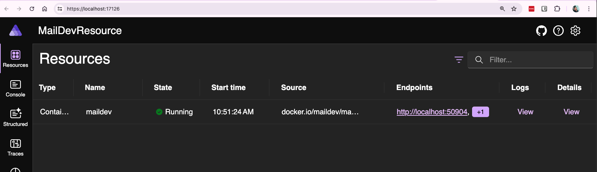

# MailDev Custom Resource
- [MailDev](https://github.com/maildev/maildev)
- MailDev resource is a development tool and not intended for production use.

## Installation
- Run Docker destop
- Up maildev server
```bash
$ docker run -p 1080:1080 -p 1025:1025 maildev/maildev
```

## Result
- 
- 