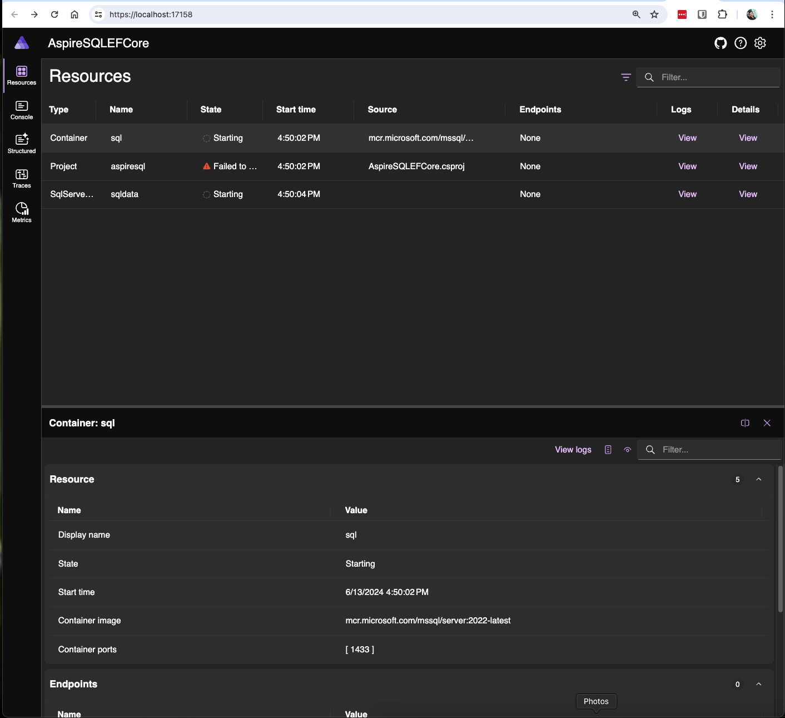

##

Steps run command lines:
- Make project folder `AspireSQLEFCore`
- Make solution: `dotnet new sln`

- Create new blazor app and add to solution
```bash
dotnet new blazor -o AspireSQLEFCore.Blazor
dotnet sln ./AspireSQLEFCore.sln add AspireSQLEFCore.Blazor/AspireSQLEFCore.Blazor.csproj
```

- Create Aspire apphost, add to solution
```bash
dotnet new aspire-apphost -o AspireSQLEFCore.AppHost
dotnet sln ./AspireSQLEFCore.sln add ./AspireSQLEFCore.AppHost/AspireSQLEFCore.AppHost.csproj
```

- Add blazor app reference to Aspire apphost
```bash
dotnet add ./AspireSQLEFCore.AppHost/AspireSQLEFCore.AppHost.csproj reference ./AspireSQLEFCore.Blazor/AspireSQLEFCore.Blazor.csproj
```

- Create Aspire service defaults project, add to solution
```bash
dotnet new aspire-servicedefaults -o AspireSQLEFCore.ServiceDefaults
dotnet sln ./AspireSQLEFCore.sln add ./AspireSQLEFCore.ServiceDefaults/AspireSQLEFCore.ServiceDefaults.csproj
```

- Add service defaults project reference to blazor app
```bash
dotnet add ./AspireSQLEFCore.Blazor/AspireSQLEFCore.Blazor.csproj reference ./AspireSQLEFCore.ServiceDefaults/AspireSQLEFCore.ServiceDefaults.csproj
```

## Issue:
- The `sql` resource cannot up, error in console:
```
fail: Aspire.Hosting.Dcp.dcpctrl.ExecutableReconciler[0]
      run session could not be started: IDE returned a response indicating failure	{"Executable": {"name":"aspiresql-9u1jeb8"}, "Reconciliation": 5, "Status": "500 Internal Server Error", "Body": "Don't know how to launch project /Users/thanhnguyen/Agility/Training/thanh.nguyendiem/dotnet-aspire-training/tutorials/AspireSQLEFCore/AspireSQLEFCore/AspireSQLEFCore.csproj. Either the project type is not supported or the project is not loaded in the solution."}
```


- [WRONG GUESS] Issue: might be because of MacOS M1 cannot run SQL Server with image is `mcr.microsoft.com/mssql/server:2022-latest` set from `Aspire.Hosting.SqlServer`
- [WRONG GUESS] Solution: not use ```Aspire.Hosting.SqlServer``` in this project. Run database in separate container, add to app host with custom resource.

- Issue: The network not stable, the app able to up sql server later but still cannot to connect due to timeout on hand-shake.
- Solution: https://github.com/alexwolfmsft/docs-aspire/blob/9f3a821b841774c1c0773d51163a25f06a4b968d/docs/database/quickstart-sql-server.md
      - Add package to apphost for set sql server password
      - `dotnet add package Aspire.Microsoft.EntityFrameworkCore.SqlServer --prerelease`
- Try to run this app https://github.com/alexwolfmsft/docs-aspire/tree/9f3a821b841774c1c0773d51163a25f06a4b968d/docs/database/snippets/tutorial/aspiresqlefcore