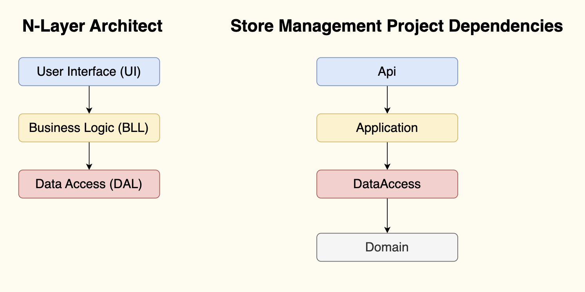

# Store Management

## Documents
- [Diagrams](https://app.diagrams.net/#G1PAwfm59TeXoJguJCFnCb85MdcqGxxwNG)
- [API doc design](https://docs.google.com/document/d/16Kpywwh32hiT98sQPJSieWHc-EHHWtm66AqJhh1ODm0)
- [Slide public demo](https://docs.google.com/presentation/d/1iNdbWwVNShd7R_37Y_86vW4DEqcnRa38dizwEHl_FJg)
- [Source code](https://gitlab.asoft-python.com/thanh.nguyen/dotnet-training/-/tree/feat/store-management/practice/StoreManagement?ref_type=heads)

## Project Structure follow N-layer architecture
> Project Dependencies



### Code structure
```
StoreManagement
└───src
│   └───Api
│   └───Application
│   └───DataAccess
│   └───Common
│   └───Logs
└───tests
│   └───UnitTests
│   └───IntegrationTests
└───StoreManagement.sln
```

**Status:**
- 🔳 Todo 🏃 Inprocess ✅ Done ❌ No support

## API Design
> Follow **RESTful** standard

### Authentication
| API | Description | Request body | Response body | Status Feature | UT |
| --- | ----------- | ------------ | ------------- | -------------- | -- |
| `POST /api/auth/register` | Register new user | registerRequest | None | ✅ | 🔳 |
| `POST /api/auth/login` | Login to system (require confirm email before login) | loginRequest | None | ✅ | 🔳 |
| `POST /api/auth/logout` | Log out of system | None | None | ❌ | ❌ |


### User Management
| API | Description | Request body | Response body | Status Feature | UT |
| --- | ----------- | ------------ | ------------- | -------------- | -- |
| `GET /api/users` | Get all users (pagination, searchTerm, orderBy) | None | Array of users | ✅ | ✅ |
| `POST /api/users` | Create user | createUserRequest | User | ❌ | ❌ |
| `GET /api/users/{id}` | Get user by id | None | User | ✅ | ✅ |
| `PUT /api/users/{id}` | Update user by id | updateUserRequest | User | ❌ | ❌ |
| `PATCH /api/users/{id}` | Partial update user by id | partialUpdateUserRequest | User | ✅ | 🔳 |
| `POST /api/users/set-role` | Set role to user | setRoleRequest | None | ✅ | 🔳 |
| `DELETE /api/users/{id}` | Delete user | None | None | 🔳 | 🔳


### Product Management
| API | Description | Request body | Response body | Status Feature | UT |
| --- | ----------- | ------------ | ------------- | -------------- | -- |
| `GET /api/products` | Get all products (pagination, searchTerm, orderBy) | None | Arrays of products | ✅ | ✅ |
| `POST /api/products` | Create a product | createProductRequest | Product | ✅ | ✅ |
| `GET /api/products/{id}` | Get a product | None | Product | ✅ | ✅ |
| `PUT /api/products/{id}` | Update a product | updateProductRequest | Product | ✅ | ✅ |
| `PATCH /api/products/{id}` | Partial update a product | partialUpdateProductRequest | Product | ❌ | ❌ |

### Shopping Cart Management
| API | Description | Request body | Response body |
| --- | ----------- | ------------ | ------------- |
| `POST shopping-carts/{id}` | Create shopping cart | - | Shopping Cart | ✅ | ✅ |
| `PUT shopping-carts/{id}/cart-items` | Update items in shopping cart | - | Shopping Cart | ✅ | 🔳 |
| `POST shopping-carts/{id}/order` | Order a shopping cart | None | - | ✅ | 🔳 |

### Order Management
| API | Description | Request body | Response body |
| --- | ----------- | ------------ | ------------- |
| `GET orders?status=` | Get orders of user | None | Array of order | ✅ | 🔳 |
| `GET orders/{id}` | Get order in detail | None | Order | ✅ | 🔳 |


## Tech-stack

| Technical | Description | Status | Opt |
| - | - | - | - |
| N-Layer | Layer architect | ✅ | required |
| SQL Server | Database | ✅ | required |
| EF Core | ORM | ✅ | required |
| Dependency Injection | Add services | ✅ | required |
| AutoMapper | Data mapping | ✅ | required |
| Swashbuckle | API document | ✅ | required |
| FluentValidation | Model validation | ✅ | required |
| Caching | Performance | ✅ | required |
| Custom middleware | | ✅ | required |
| XUnit, MOQ | Unit testing | ✅ | required |
| Integration Test | | ✅ | required |
| .Net Analyzer | source code analysis | ✅ | required
| .http files | manual test api | ✅ | required
| Generic repository pattern | | ✅ | optional |
| Unit of Work pattern | | ✅ | optional |

