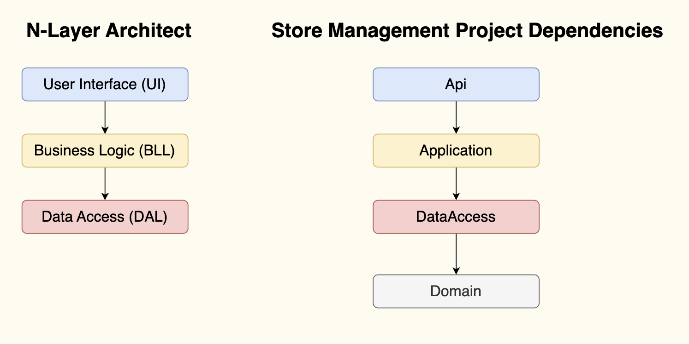

# Issues & Solutions

## Task: Project structure with N-layer architect
- Issues: Setup up wrong, add project reference not correct.
  - For example, add `Shared` ref in `Api` without understand by layer
- Solution: Take time to understand N-layer architect
  - [Reading][Common web application architectures](https://learn.microsoft.com/en-us/dotnet/architecture/modern-web-apps-azure/common-web-application-architectures)
  - [How to structure a layered architecture in .NET Core project](https://www.youtube.com/watch?v=S86Y0sxXhDE)
  - Understands about Project Dependencies and draw Store Management projects dependencies diagrams
    - 
    - [N-Tier-Architecture](https://github.com/nuyonu/N-Tier-Architecture)

## Task: Setup MySQL database run on Mac (M1 & M2 - AMD)
- **Issue**:
  - Docker cannot run with MSSQL `mcr.microsoft.com/mssql/server:2022-latest` - on Mac M1, M2 (AMD64)
- **Solution**: replace by `mcr.microsoft.com/azure-sql-edge`
  - Known issue: lack of `CLR` support (sqlcmd tool is not available the ARM64 version of SQL Edge containers), so cannot access database and run command
  - Replacement:
    - use extension `SQL Server` in VSCode to connect and run SQL query
    - use app `Azure Data Studio` to connect and action in DB
- **Ref**:
  - [Github Issue](https://github.com/microsoft/mssql-docker/issues/668)
  - Guide [MySQL on Mac](https://devblogs.microsoft.com/azure-sql/development-with-sql-in-containers-on-macos/)

## Task: Working with EF Core
- Issue: Run migrations:
```powershell
cd src/DataAccess
dotnet ef migrations add InitialSchoolDB
```
Get error:
```
Unable to create a 'DbContext' of type ''. The exception 'Unable to resolve service for type 'Microsoft.EntityFrameworkCore.DbContextOptions`1[StoreManagement.Data.StoreManagementDbContext]' while attempting to activate 'StoreManagement.Data.StoreManagementDbContext'.' was thrown while attempting to create an instance. For the different patterns supported at design time, see https://go.microsoft.com/fwlink/?linkid=851728
```

- **Solution 1**: overload constructure to allow continuing without the application service provider

```csharp
public class StoreManagementDbContext : IdentityDbContext
{
    // Fix bug when run migration `dotnet ef migrations add InitialSchoolDB`
    // An error occurred while accessing the Microsoft.Extensions.Hosting services. Continuing without the application service provider. Error: The entry point exited without ever building an IHost.
    public StoreManagementDbContext() { }
}
```

- **Solution 2** (should refer): Run ef command with `--startup-project` is `Api` with has `host`
```
dotnet ef migrations add <MigrationName> --startup-project ../Api/StoreManagement.Api.csproj
```
or 
```
dotnet ef migrations add <MigrationName> -s ../Api/StoreManagement.Api.csproj
```
## Task: Identity Framework
- Issue: Redundant code on setup Identity Framework
  - add identity core
  - write services, controllers to handle login, register
- Solutions: Checkout [source code](https://github.com/dotnet/aspnetcore/tree/main/src/Identity) of Identity Framework, use their endpoints and remove redundant code.
- Follow up issue:
  - How to register user with default role is User?
  - How to create cart for user after register successfully?


## Task: Error Handling
- Issue: Pick exception handling or result pattern
- Solution:
  - [Read][Error handling](https://learn.microsoft.com/en-us/aspnet/Domain/fundamentals/error-handling)
  - As avoid leak information and performance, I pick result pattern.
  - If has error, the logger will log to file to track by id.

## Task: Apply pattern Generic Repository and Unit of Work
- Issue: Confuse about why need both of them when ef is include them
- Solution:
  - Read more [Implement Repository and Unit of Work patter in ASP.NET MVC](https://asoft-devops.slack.com/archives/DKW8GTJBG/p1715849976433919)
  - Not apply unit of work pattern yet

## Task: Dockerize App
- Issue & solution of [Docker - Cannot connect to sql server from api](https://gitlab.asoft-python.com/thanh.nguyen/dotnet-training/-/issues/89)

## Task Initialize Database
- Issue 1: Seed data to database - do we need to handle it as a DI service?
  - Solution: Extend the host and get service from service provider to seed data.
- Issue 2: What kind of data should be seeding in db prod?
  - Solution: Only roles (user, admin) and admin account.
- Issue 3: user required to confirm email to login. Admin account created by seeding data could not login.
  - Solution: update `User` entity to `EmailConfirmed = true` when seeding data.
- Issue 4: How to separate to seed data for dev and prod?
  - Solution: use env to check environment and seed data.

## Task: Pagination
- Issue: Reuse code - Implement pagination through all kind of lists in the project
- Solution: Implement generic pagination ([video ref](https://www.youtube.com/watch?v=sVoC2OG9YZo))
- Solution: Combine with Specification pattern

# Task: search, sort, filter
- Issue: Reuse code - Implement search, sort, filter through all kind of lists in the project
- Solution: Specification pattern ([video ref](https://www.youtube.com/watch?v=axkJDACUGZQ))

# Task: API versioning
- Issue: API versioning setup not work for API identity (default)
  - The config API version work well on API in controller but not work on API identity (default)
  - ``app.MapGroup("api/v1/auth").MapIdentityApi<User>();``
- Solution: (not yet)

# Caching: How to solve cache of list of products
- Issue: How to cache list of products, when it has search item, sort, filter, etc.
- Solution: Use addition key to cache the list of ids of products

- Issue: user register by identity lead to cannot know how to evict cache of user list
- Solution: (not yet)

## Id format
- Issue: IdentityUser has id is `string`, but product id is `Guid` lead to convert between string and Guid many times
- Solution: Change id of product to string. But should validate carefully on uuid format.

## Task: Related data
- Issue: How to get related data in ef core
- Solution: Use `Include` to get related data, explicit load data, async load:
  - https://learn.microsoft.com/en-us/ef/core/querying/related-data/


## Others ref:
- [Structured Logging with Serilog in ASP.NET Core](https://codewithmukesh.com/blog/structured-logging-with-serilog-in-aspnet-Domain/)
- [REST client](https://marketplace.visualstudio.com/items?itemName=humao.rest-client )
- [Why I Use The Unit of Work Pattern With EF Core](https://www.youtube.com/watch?v=vN_j1Bs0ALU)
- [Unit Of Work](https://www.youtube.com/watch?v=vN_j1Bs0ALU)
- [How I Use The Generic Repository Pattern In Clean Architecture](https://www.youtube.com/watch?v=kwehxBDX_o8)
- [Web API Development in .NET 8 in 2 Hours | ASP.NET CORE | RESTFUL API](https://www.youtube.com/watch?v=SsnpkRNhpmk)
- [Get started with Swashbuckle and ASP.NET Core](https://learn.microsoft.com/en-us/aspnet/Domain/tutorials/getting-started-with-swashbuckle)
- [Swashbuckle and NSwag](https://code-maze.com/aspnetcore-swashbuckle-vs-nswag/)
- [Implement the infrastructure persistence layer with Entity Framework Core](https://learn.microsoft.com/en-us/dotnet/architecture/microservices/microservice-ddd-cqrs-patterns/infrastructure-persistence-layer-implementation-entity-framework-core)
- [Design a microservice-oriented application](https://learn.microsoft.com/en-us/dotnet/architecture/microservices/multi-container-microservice-net-applications/microservice-application-design)
- [Development workflow for Docker apps](https://learn.microsoft.com/en-us/dotnet/architecture/microservices/docker-application-development-process/docker-app-development-workflow)
- [Online code compile in C#](https://sharplab.io/)
- [Aspnet API versioning](https://github.com/dotnet/aspnet-api-versioning/tree/main)

---

## Remaining:
  - Remaining:
    - Integration testing
  - Known issues / improvement:
    - [Improve feature] Order should go along with address
    - Validator for request data

## Feedback after public demo
- [Tu.Phan] Recheck | and || - or condition is different with bitwise
- [Thanh.Truong] Consider to use middleware to handle response failure instead of duplicate code in controller
- [Hien.Nguyen] Check api versioning (the different was my app use controller but identity endpoint use minimal apis
- [Binh.Huynh] Should not call await in loop
- [Binh.Huynh] Should create items along to cart, should not separate logic add cart and add items
- [Canh.Doan] Check any could be CreateOrderDTO?.Any()
- [Viet.Phan] Handle validation by data in fluent validation instead of put them in service code
- [Viet.Phan] Should more active on raise issue and keep performance on practice

## Known issues:
- [Bug] API versioning on Swagger with Identity
- [Improvement] Solution on update cart still not good
- [Improvement] Should handle auto create cart after register user
- [Feature] Missing some feature on order address, payment
- Lack of testing
  - Integration testing with authenticated endpoint
  - Init data on test and clean up
- Patch update  (should try out)