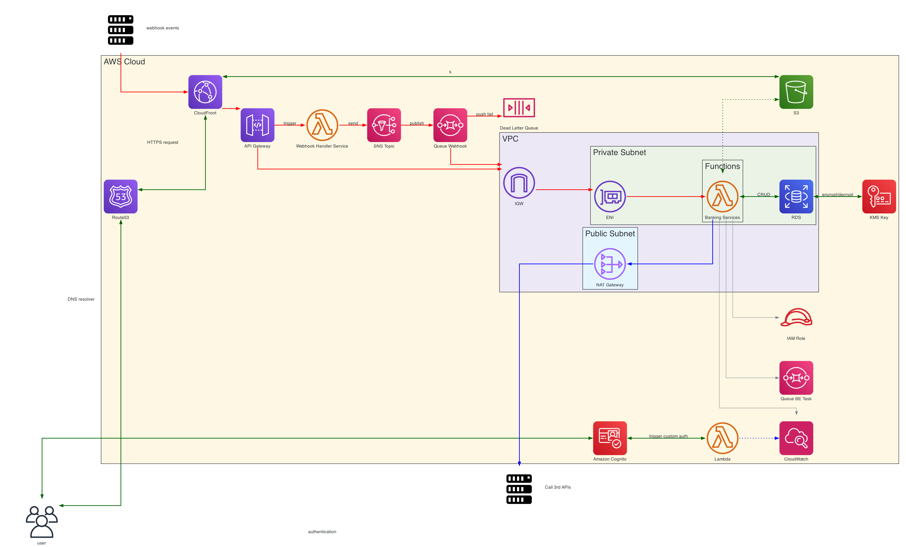
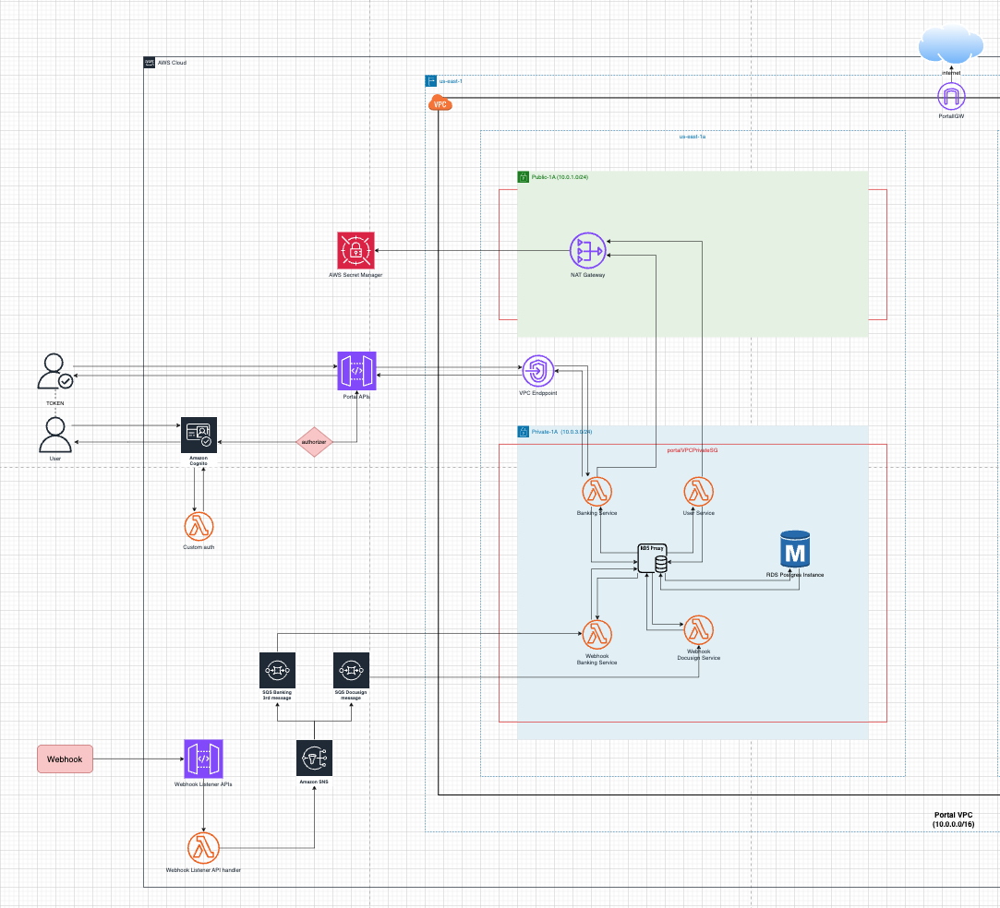
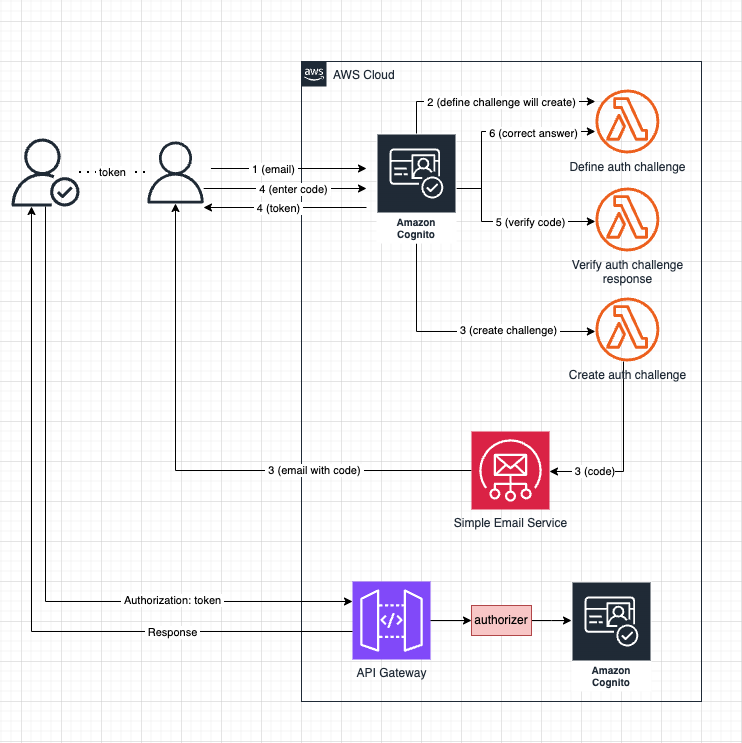
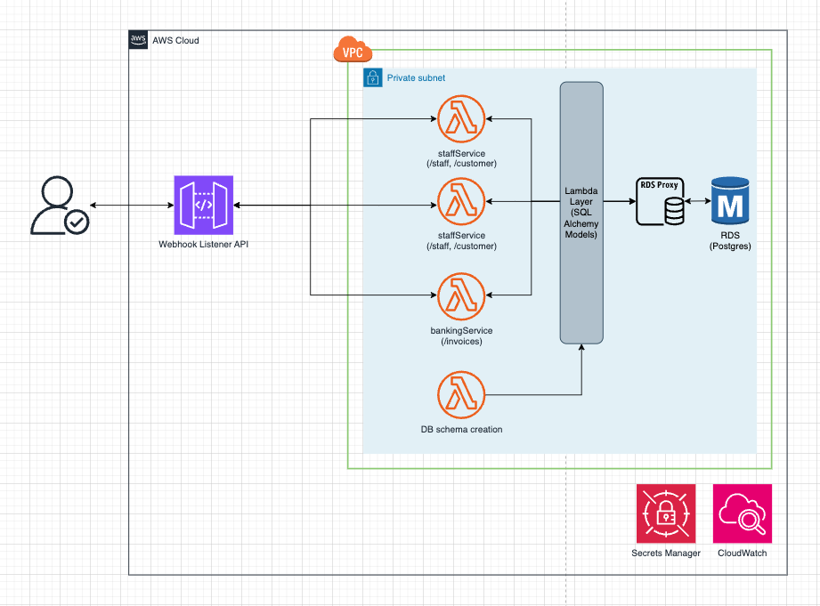
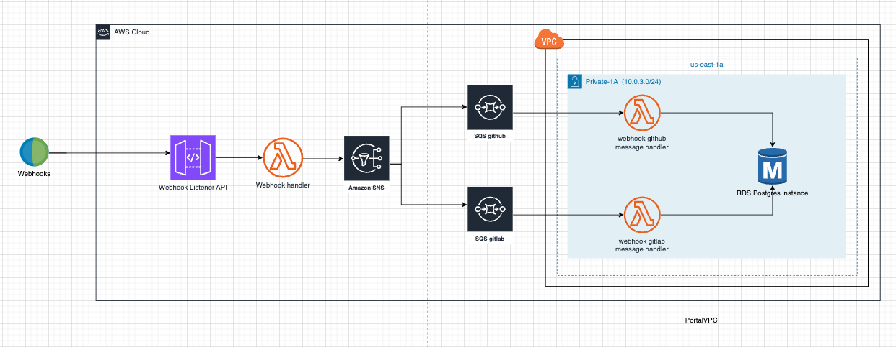
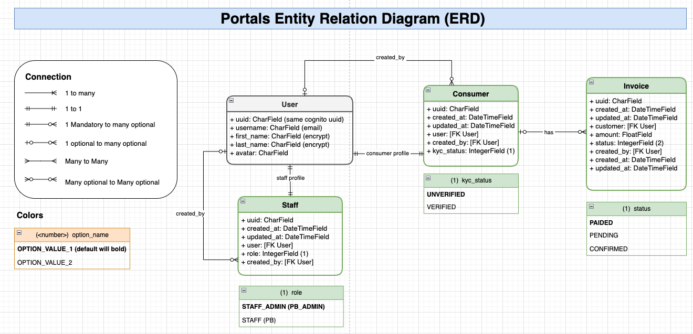

# Portal Serverless System

## Intro
This project is companion source code to Portal Serverless Architect (Code in AWS Console)
- [Portal Architect](https://app.diagrams.net/#G1dRVjvGi18fWnYYDqWcG5BL1T5DxTfLXG)
- [Practice Document](https://docs.google.com/document/d/1WXbl9EBLVajw6XhQTwh51pjjvvE-s2hDAJscNiW_ymw/edit?usp=sharing)

### High Level Architect

### Built Portal Architect

- Authentication Flow

- Main flow

- Webhook Flow

### Portal Application
#### ERD

