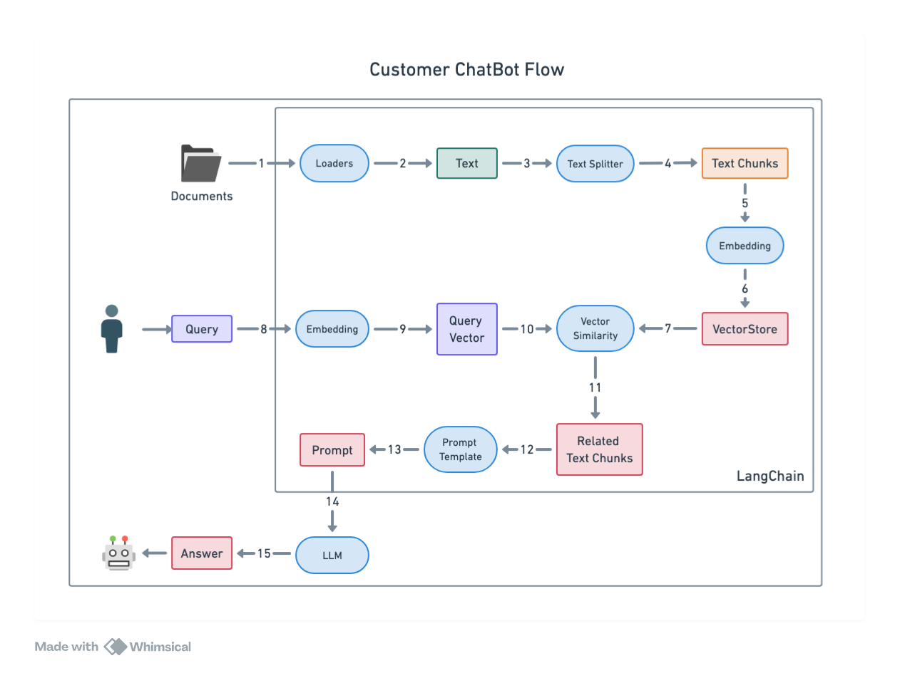

# [IVY moda](https://ivymoda.com/) - Customer Support RAG with Evals Driven Development
This RAG practice allow you to ask question to customer support chatbot and get the answer based on knowledge base.

# Pre-requisite
## Debug:
- telnet

## Technical Stack
- Python 3.13
- LangChain
- Promptfoo

## LLM Development Approach
### Evals Approach
  - Evaluations (Evals) is the process of measuring an Ml model's performance against **gold-standard benchmarks** to ensure accuracy, reliability, and alignment with real-world tasks.
  - Evals are critical to build successful AI products. By write evals, test prompts like test driven development, we ensure the quality of AI product
### Promptfoo
- Main purpose of Promptfoo is "test-driven LLM development"


## RAG Chatbot flow


RAG Two main components:
1. RAG - Indexing
    1.1 Load documents
    1.2 Split documents
    1.3 Store
2. RAG - Retrieval and Generation
    2.1 Retrieve
    2.2 Generate

## How to use
0/ Setup project env
- Access project:
```
git clone repo
cd 3-practice/3-4-customer-support-rag-with-eval
```
- Setup virtual env:
```
uv venv
source .venv/bin/activate
```
- Make .env file:
```
cp .env.example .env
```
then fill in.
- Set .env as uv env file and load environments variables
  - This also go install all dependencies
```
uv run --env-file .env python ./scripts/load_env.py
```

1/ Setup data
- Run ingest data to setup embeddings db:
`uv run src/rag/ingest.py`
- Force create embeddings db:
`uv run src/rag/ingest.py --force true`


2/ Run app
`uv run streamlit run src/app/app.py`

3/ Run evals
- `cd evals`
- Use `evals/README.md` to do

## Code Structure
```
customer-support-agent-with-eval/
├── documents/                  # Projects documents
├── data/                       # External data directory
│   ├── documents/              # Raw documents
│   ├── embeddings/             # Pre-trained embeddings -> save vector db here
|
├── src/                        # Core application code
|   ├── rag/                   # RAG-specific components
│   |   ├── __init__.py
│   |   ├── loaders/
|   |   |   ├── __init__.py
|   |   |   ├── base_loader.py
|   |   |   ├── txt_loader.py
|   |   |   ├── json_loader.py
|   |   |
│   |   ├── vector_stores/
|   |   |   ├── __init__.py
|   |   |   ├── base_store.py
|   |   |   ├── faiss_store.py
|   |   |
|   |   ├── retrievers/
|   |   |   ├── __init__.py
|   |   |   ├── base_retriever.py
|   |   |   ├── similarity_search_retriever.py
|   |   |
|   |   ├── chains/
|   |   |   ├── __init__.py
|   |   |   ├── chain.py
|   |   |
|   |   ├── text_splitters/
|   |   |   ├── __init__.py
|   |   |   ├── base_splitter.py
|   |   |   ├── text_splitter.py
|   |
|   ├── models/
|   |   ├── __init__.py
|   |   ├── base_model.py
|   |   ├── openai_model.py     # OpenAI GPT integration
|   |
|   ├── prompts/                # Prompt templates for LLMs
|   |   ├── __init__.py
|   |   ├── prompt_template.py
|   |
|   ├── parsers/                 # Output parser
|   |   ├── __init__.py
|   |   ├── output_parser.py
|   |
|   ├── callbacks/
|   |   ├── __init__.py
|   |   ├── callback_handler.py
|   |
|   ├── utils/
|   |   ├── __init__.py
|   |   ├── logger.py
|   |   ├── config.py
|   |   ├── exception_handler.py
|   |
|   ├── evals/
|   |   ├── __init__.py
|   |   ├── data/               # Eval data like sample dataset
|   |   ├── output/             # Eval output like json, csv
|   |   ├── performance.py
|   |
|   ├── memory/
|   |   ├── __init__.py
|   |
|   ├── app.py                  # Main application entry point
|
├── tests/
│   ├── __init__.py
│   ├── test_app.py
│   ├── test_loaders.py
│   ├── test_retrievers.py
│   ├── test_chains.py
│   ├── test_splitters.py
│   ├── test_parsers.py
|
├── README.md
├── pyproject.toml
├── .env
```